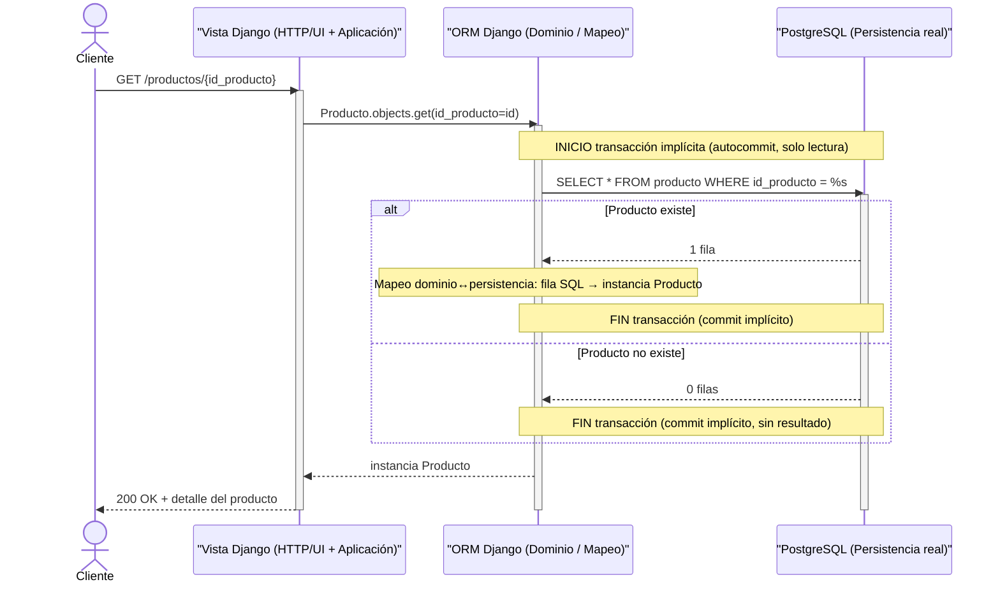
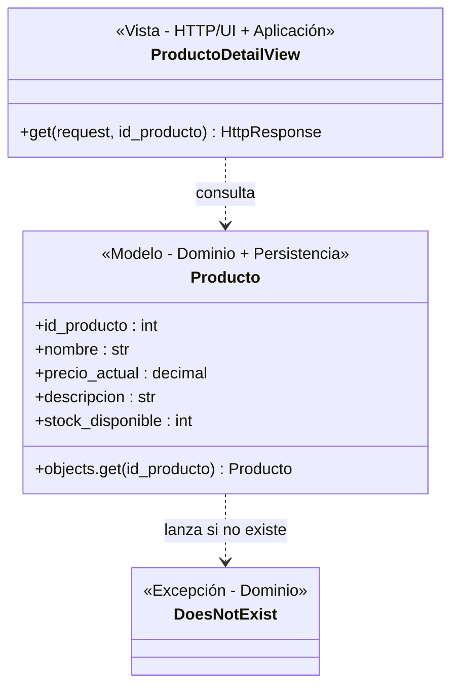

# Selección de rebanada.
Candidata A — Consultar catálogo

Rebanada vertical:

UI → HTTP → aplicación → dominio → persistencia real (PRODUCTO) → migración

Permite atravesar las cinco fronteras técnicas.
La operación principal es de consulta de PRODUCTO, sin introducir todavía carrito, pedido, ticket o concurrencia.
El modelo de datos ya define PRODUCTO, por lo que no requiere inventar una entidad para hacer la rebanada.
Candidata B — Crear ticket de soporte asociado a pedido

UI → HTTP → aplicación → dominio → persistencia real (TICKET_SOPORTE) → migración

También cruza las cinco fronteras, pero incorpora más reglas: autenticación/autorización del cliente, asociación con un pedido, datos del ticket, identificador, estado y las discrepancias existentes respecto de asunto.

Elección — Candidata A: Consultar catálogo

Fronteras que cruza explícitamente:

HTTP/UI
Aplicación
Dominio
Persistencia real
Migración

Es la mejor primera rebanada porque atraviesa todas las fronteras solicitadas sin introducir el problema duro ni las reglas de carrito/pedido/ticket.

Descartada — 3 líneas:
La creación de ticket cruza la misma cantidad de fronteras, pero introduce más dominio: cliente, pedido, ticket, estado e identificador.
Además, el asunto exigido por las historias no está resuelto en el modelo de datos.
Por eso tiene mayor riesgo de obligarnos a inventar o reconciliar decisiones antes de tener el esqueleto andando.

# Diagrama de secuencia.

# Diagrama de clases.

# Contrato de la prueba unica

Punto de entrada: una petición HTTP GET real contra la ruta /productos/{id_producto} del servidor Django en ejecución (no una llamada directa a la vista ni al modelo en memoria).

Precondición de datos: en la base de datos PostgreSQL real (no una base de pruebas simulada en memoria), debe existir previamente una fila en la tabla producto con un id_producto conocido — insertada directamente contra esa tabla (fixture o INSERT de preparación), no a través de la vista que se está probando, para no acoplar la prueba a su propio objeto bajo prueba.

Acción: ejecutar GET /productos/{id_producto} usando ese id_producto conocido.

Aserción observable: la respuesta HTTP debe tener código 200, y el cuerpo debe contener exactamente el nombre, precio_actual, descripcion y stock_disponible que se insertaron en la precondición — comparados campo por campo.

Estado esperado en la base de datos real: sin cambios — la fila en producto sigue existiendo con los mismos valores después de la petición (es solo lectura; cualquier alteración señalaría una fuga de estado).

Ruta de error: ejecutar GET /productos/{id_producto_inexistente} con un id que no exista, y verificar respuesta 404 (no 500 ni 200 con cuerpo vacío).

Frontera que puede romperse sin ser detectada: Migración — consecuencia directa del vacío ya señalado (decisión pendiente managed=True/False).
