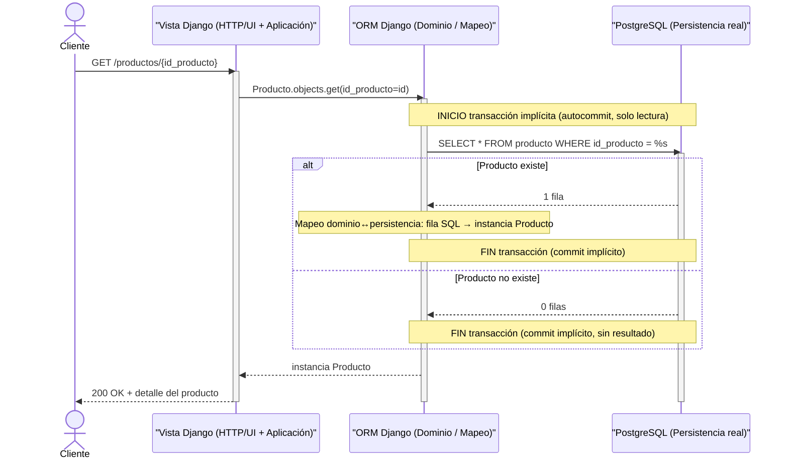
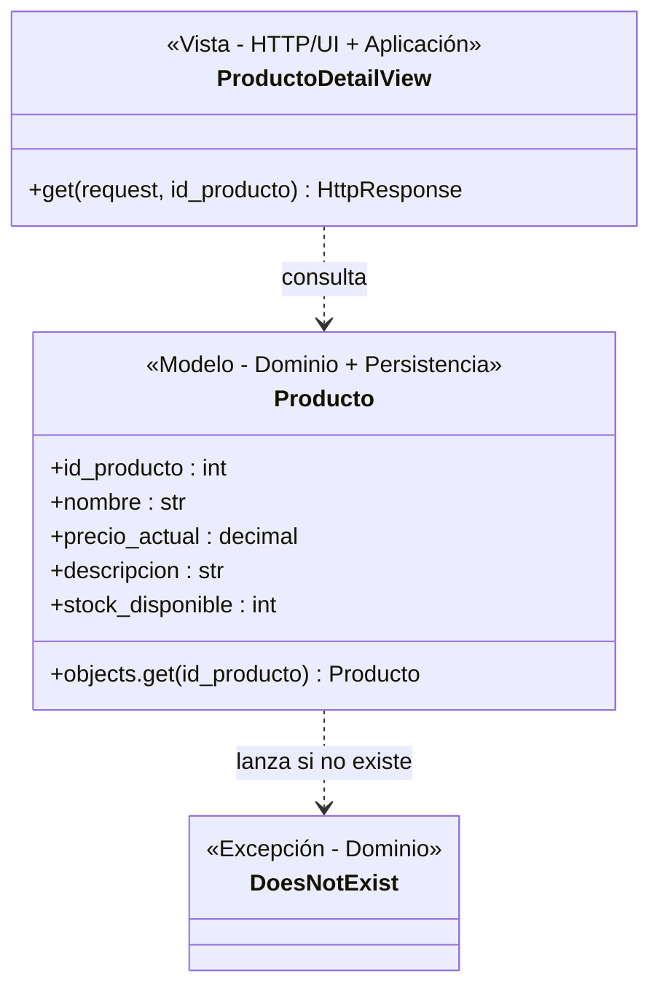

# Selección de rebanada.
Candidata A — Consultar catálogo

Rebanada vertical:

UI → HTTP → aplicación → dominio → persistencia real (PRODUCTO) → migración

Permite atravesar las cinco fronteras técnicas.
La operación principal es de consulta de PRODUCTO, sin introducir todavía carrito, pedido, ticket o concurrencia.
El modelo de datos ya define PRODUCTO, por lo que no requiere inventar una entidad para hacer la rebanada.
Candidata B — Crear ticket de soporte asociado a pedido

UI → HTTP → aplicación → dominio → persistencia real (TICKET_SOPORTE) → migración

También cruza las cinco fronteras, pero incorpora más reglas: autenticación/autorización del cliente, asociación con un pedido, datos del ticket, identificador, estado y las discrepancias existentes respecto de asunto.

Elección — Candidata A: Consultar catálogo

Fronteras que cruza explícitamente:

HTTP/UI
Aplicación
Dominio
Persistencia real
Migración

Es la mejor primera rebanada porque atraviesa todas las fronteras solicitadas sin introducir el problema duro ni las reglas de carrito/pedido/ticket.

Descartada — 3 líneas:
La creación de ticket cruza la misma cantidad de fronteras, pero introduce más dominio: cliente, pedido, ticket, estado e identificador.
Además, el asunto exigido por las historias no está resuelto en el modelo de datos.
Por eso tiene mayor riesgo de obligarnos a inventar o reconciliar decisiones antes de tener el esqueleto andando.

# Diagrama de secuencia.

# Diagrama de clases.

# Contrato de la prueba unica

Punto de entrada: una petición HTTP GET real contra la ruta /productos/{id_producto} del servidor Django en ejecución (no una llamada directa a la vista ni al modelo en memoria).

Precondición de datos: en la base de datos PostgreSQL real (no una base de pruebas simulada en memoria), debe existir previamente una fila en la tabla producto con un id_producto conocido — insertada directamente contra esa tabla (fixture o INSERT de preparación), no a través de la vista que se está probando, para no acoplar la prueba a su propio objeto bajo prueba.

Acción: ejecutar GET /productos/{id_producto} usando ese id_producto conocido.

Aserción observable: la respuesta HTTP debe tener código 200, y el cuerpo debe contener exactamente el nombre, precio_actual, descripcion y stock_disponible que se insertaron en la precondición — comparados campo por campo.

Estado esperado en la base de datos real: sin cambios — la fila en producto sigue existiendo con los mismos valores después de la petición (es solo lectura; cualquier alteración señalaría una fuga de estado).

Ruta de error: ejecutar GET /productos/{id_producto_inexistente} con un id que no exista, y verificar respuesta 404 (no 500 ni 200 con cuerpo vacío).

Frontera que puede romperse sin ser detectada: Migración — consecuencia directa del vacío ya señalado (decisión pendiente managed=True/False).

# Trazabilidad

# Trazabilidad — Rebanada: Consultar detalle de producto

| Elemento del diagrama | Archivo de origen | Línea o sección que lo respalda |
|---|---|---|
| Historia "consultar detalle de producto" | `docs/Historia de usuario/historias.md` | Prioridad 2, criterio 3: "El cliente puede consultar el detalle de un producto." |
| Entidad `PRODUCTO` (`id_producto`, `nombre`, `precio_actual`, `descripcion`, `stock_disponible`) | `docs/models/data-model.md` | Bloque `PRODUCTO { ... }` |
| Tabla real `producto` en PostgreSQL | Script SQL ejecutado por el equipo (verificado en pgAdmin) | `CREATE TABLE producto (...)` |
| Ruta de error "producto no existe" → 404 | — | **VACÍO** — ningún insumo define este comportamiento; se usó como ruta mínima exigida por el enunciado de la Tarea 2 |
| Ruta HTTP `/productos/{id_producto}` | — | **VACÍO** — ningún insumo define rutas ni contratos de API |
| Uso de ORM Django | — | **VACÍO** — no lo prescribe ningún insumo; decisión del equipo tomada fuera de estos documentos |
| `stock_disponible` para marcar "agotado" | `docs/Historia de usuario/historias.md` | Prioridad 2, criterio 4 — existe en el modelo, pero queda fuera de alcance de esta rebanada (no es vacío del diagrama) |

# Vacios

# Vacíos detectados

Elementos que los insumos del proyecto (`vision-producto.md`, `historias.md`, `problema-duro.md`,
`data-model.md`, `domain_model.md`) no definen, y que por regla de fidelidad no se inventaron.

1. **No hay modelo de autenticación** — la Historia 1 exige registro/login con rol (cliente/agente/administrador), pero ninguna tabla tiene campos de contraseña ni de rol.
2. **No existe el actor Administrador** en ningún modelo de datos — solo están `CLIENTE` y `AGENTE`.
3. **Mecanismo de concurrencia sin decidir** — `problema-duro.md` propone 3 opciones (bloqueo optimista, pesimista, o `SELECT FOR UPDATE`/`SERIALIZABLE`) pero no elige ninguna, y ningún modelo tiene el campo de control correspondiente (ej. `version`).
4. **Sin formato de identificador de negocio** — las historias piden `PED-00001` y `TCK-00001` (o UUID) para pedidos y tickets, pero los modelos solo tienen enteros autoincrementales.
5. **Falta el campo `asunto`** en `TICKET_SOPORTE` — las historias 5 y 6 lo piden, pero el modelo solo tiene `descripcion`.
6. **Inconsistencia entre modelos**: `data-model.md` no tiene `total` en `PEDIDO`, pero `domain_model.md` sí.
7. **Otra inconsistencia**: la cardinalidad CLIENTE–CARRITO cambia entre los dos modelos (obligatoria vs. opcional), y el campo de `ASIGNACION` se llama distinto en cada uno (`fecha_hora` vs. `timestamp`).
8. **Sin estados formalmente enumerados** — no se definen los valores válidos de `estado` (pedido/ticket), ni la regla de consistencia entre ambos que exige `vision-producto.md`.
9. **Sin definición de API/rutas** — ningún insumo especifica endpoints, verbos HTTP, ni si es API separada o vistas renderizadas por Django.
10. **Decisión pendiente sobre `managed=True/False`** en el modelo `Producto`, que afecta si la frontera de "Migración" se cruza de verdad en la rebanada elegida.

---

**Nota:** en el diagrama de secuencia (Tarea 2) no se presentó este problema, debido a que se escogió la Candidata A (consultar detalle de producto) en lugar de la Candidata B — la rebanada elegida no depende de ninguno de los vacíos anteriores para completarse de extremo a extremo.
